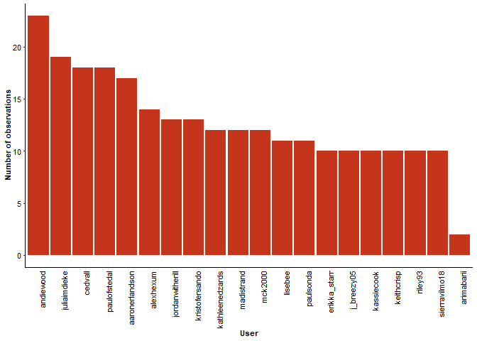

# I Naturalist Student Participation.

Dontae Johnson, Chris Merkford

Biosciences Department, Minnesota State University Moorhead, 1104 7th
Avenue South, Moorhead, MN 56563 USA

## Abstract

The question that will be being addressed is MSUM student related I
naturalist data. I natrualist is a program that allows people to track
sightings of local fauna on an online database. This online data base
allows people to dientify these sightings from all over the world. The
data set being used will be from I naturalist and it will be using data
specifically from clay county. This exploratory data analysis will be
analyzing how MSUM students contribute to observations. Contributions
being measured will be how many students use I naturalist outside of
class the following year. This will show how much students continue to
use the program.

## Introduction

The question that is being addressed is students continued
participation, and their interest in ecology after the class has ended.
I naturalist is a program that allows anyone to make observations about
local fauna. These observations can then be identified by others online.
I will be taking the data that is automatically stored through I
naturalist and sifting through it to figure out information about the
observation students make within different time frames. There are many
applications for this kind of data analysis. Continued engagement within
any field in which a website or app is used could benefit from this kind
of data analysis.

## Methods

Data was extracted from the MSUM ecology i naturalist group in 2019.
This was then compared to data from the following year to see if any of
the listed names in 2020 continued to use the program outside of class
the following year. More information could not be listed due to size
limitations in R Studio. The professor was removed from the data set to
better analyze just the students in question.

## Results

<!-- --><!-- -->

The maximum amount of observations made during class time was 23, the
minimum was 2, the mean was 12.75, with a median of 12. 10% of students
returned the following year to the app making observations on their own.
With the students who did return making a maximum of 3 observations.

## Discussion

The results show that there is continued interest in using I naturalist
once the class has finished. Further studies should encompass more data
over a wider area as some students may have used I naturalist outside of
clay county the following year. However shifting through the amount of
data that would be on the app on a global scale would prove next to
impossible.

## References

Vijay Barve and Edmund Hart (2021). rinat: Access ‘iNaturalist’ Data
Through APIs. R package version 0.1.8.
<https://CRAN.R-project.org/package=rinat>

-   Wickham et al., (2019). Welcome to the tidyverse. Journal of Open
    Source Software, 4(43), 1686, <https://doi.org/10.21105/joss.01686>

-   RStudio Team (2021). RStudio: Integrated Development Environment
    for R. RStudio, PBC, Boston, MA URL <http://www.rstudio.com/>.
